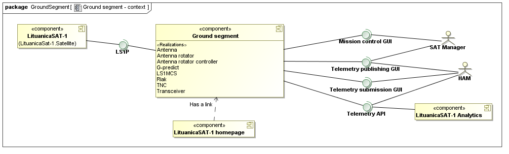
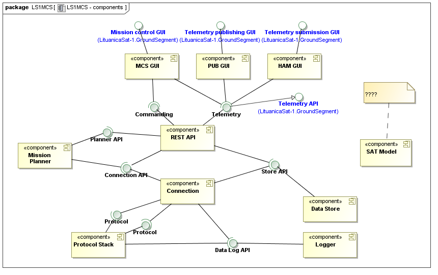

% LS1MCS and Ground Segment Architecture
% Karolis Petrauskas <k.petrauskas@gmail.com>
% 2013-04-11

Introduction
============

Purpose of the document
-----------------------

Document structure
------------------

Editing the document
--------------------

Revision history
----------------

--------------------------------------------------------------------------
Date         Author              Comments
------------ ------------------- -----------------------------------------
2013-04-11   K. Petrauskas       Initial revision
--------------------------------------------------------------------------
Table: Revision history.

Scope definition
================

Requirements overview
=====================

Architecture decisions
======================

Information architecture view
=============================

Functional view
===============

Process view
============

Deployment view
===============

Non functional aspects
======================

Summary
=======

